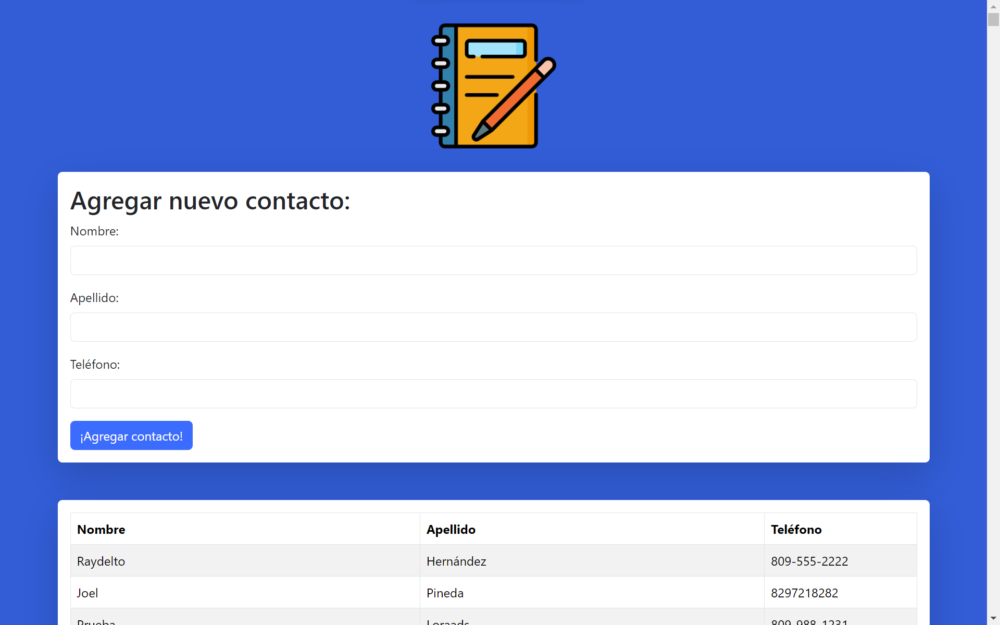

## Agenda React

Esta es la tarea #4 de Emmanuel Soto, esta es la captura de pantalla:

<!-- Illustration image. -->

> Foto de mi Agenda en React.

Tarea #4 </> Agenda React:

Haga nueva vez la agenda pautada en la tarea #3 pero esta vez utilice la librería de Javascript React. Haga un componente para mostrar el listado de contactos y un componente para agregar nuevos contactos. Ambos componentes estarán contenidos en un componente padre.